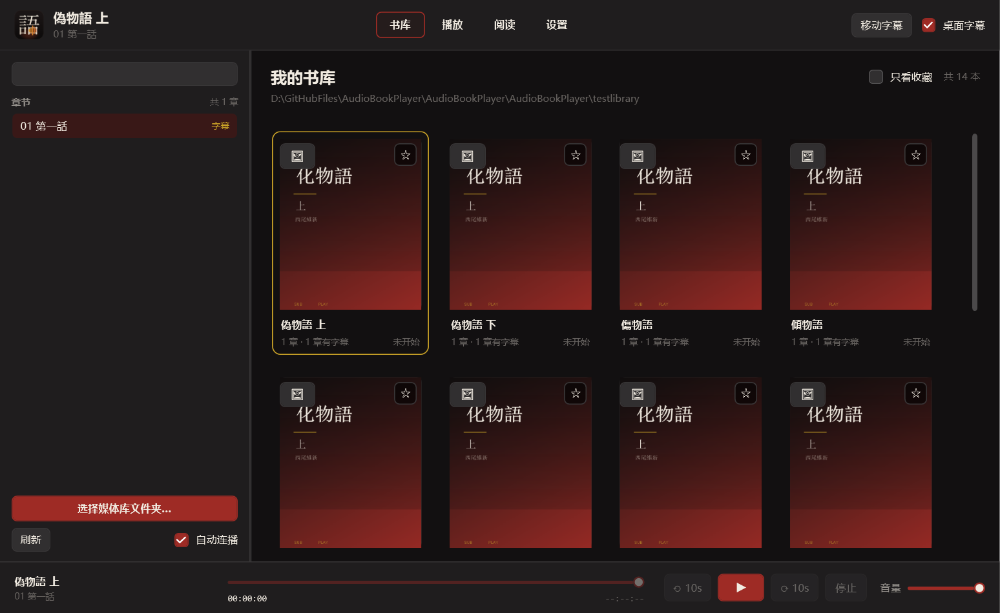
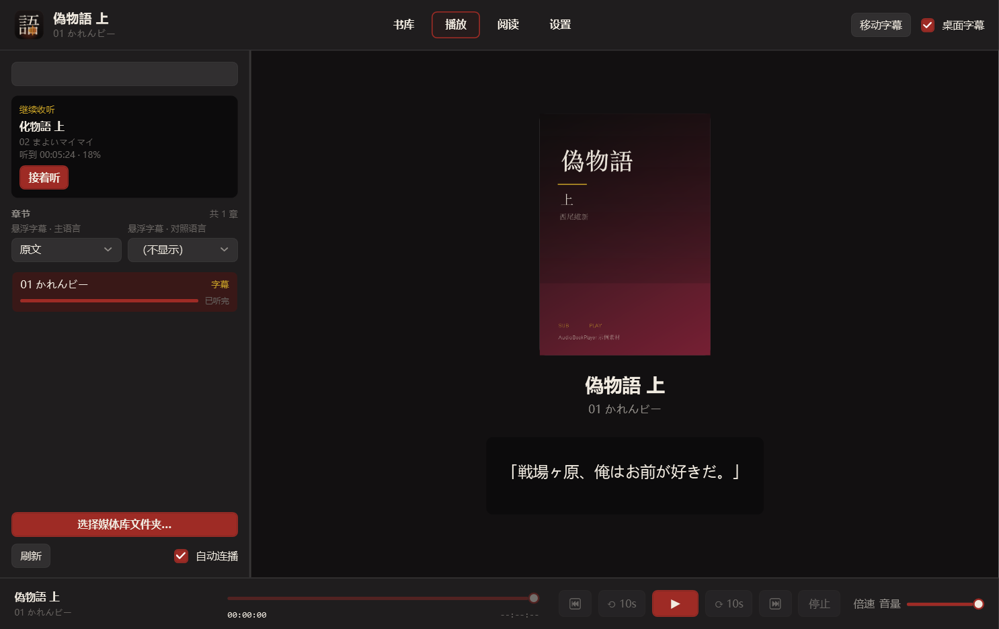
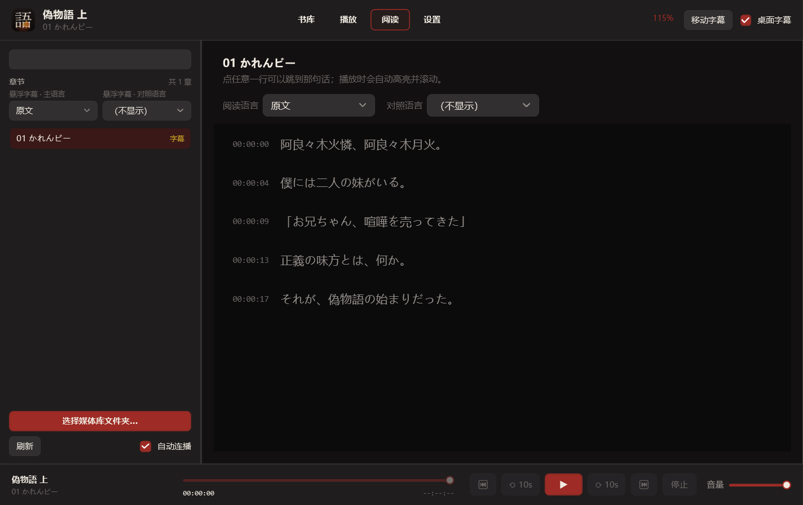
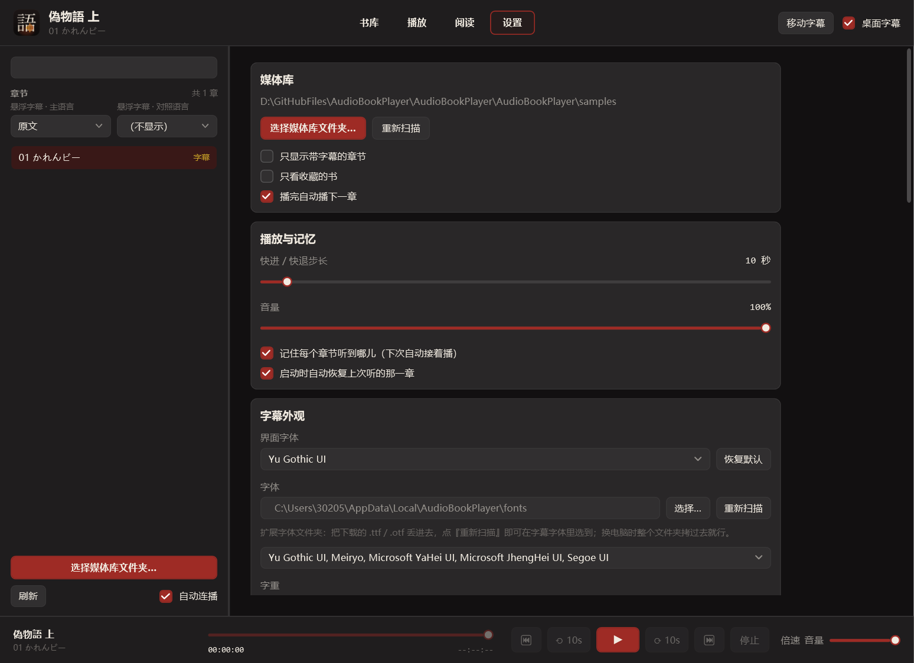

# KATARU — 有声书播放器 + 桌面悬浮字幕

播放有声书 / 音频，同时按 SRT 时间轴在**桌面最上层显示透明字幕**。
字幕是一个独立的 WPF 窗口：无边框、全透明、始终置顶、鼠标穿透、**永不抢键盘焦点**——
所以你可以一边在 Rider / VS Code 里写代码，一边看字幕。

```
┌─────────────────────────────────────┐
│ Rider                               │
│                                     │
│ private void Update()               │
│ {                                   │
│     ...                             │
│                                     │
│       「戦場ヶ原、俺はお前が好きだ」 │
└─────────────────────────────────────┘
```

* 图标：近黑圆角方底 +「語」字，均衡器嵌在「吾」下面那个「口」的负空间里
* 技术栈：C# / WPF / .NET 9 / Win32 (P/Invoke)
* **零第三方依赖**：没有 Unity、没有 Electron、没有 NAudio、没有 MVVM 框架
* 配色可换：内置 5 套预设，也能单独调背景 / 文字 / 强调 / 金，改完立刻生效
* 界面分 **书库 / 播放 / 阅读 / 设置** 四种模式
* 字幕窗口可以**解锁拖动**摆位、滚轮调字号；平时完全鼠标穿透
* **全局热键**：不在前台也能播放/暂停、快进快退、显隐字幕
* **多语言字幕 / 双语模式**：同一条音频可以挂多份不同语言的 SRT，随时切换或中日对照显示
* 会读 m4b 的**内嵌章节 / 作者 / 朗读者 / 内嵌封面**，封面也能手动指定
* 数据会记住：听到哪儿、最近播放、收藏、自定义封面、配色与全部设置
* 产物：Windows x64 可执行程序

| 书库 | 播放 | 阅读 | 设置 |
| --- | --- | --- | --- |
|  |  |  |  |

---

## 1. 使用方式

1. 点左下角 **「选择媒体库文件夹…」**
2. 程序**递归扫描**这个文件夹（可以有很多层子目录）：
   * **每个文件夹 = 一本书**，书名取文件夹名
   * 文件夹里的音频按**自然顺序**（第2章 在 第10章 前面）排成章节
   * 章节自动配对同目录下的字幕：`化物語 上.m4b` ↔ `化物語 上.srt`，
     也支持 `化物語 上.ja.srt`、`化物語 上（字幕）.srt` 这类命名
   * 文件夹里有 `cover.jpg` / `folder.png` / `封面.png` 就当封面（本级 → 上一级 → 媒体库根目录）
3. **书库**里点书（双击直接播）→ 左侧切章节 → 底部播放条控制
4. **阅读**模式看整篇字幕跟读，当前朗读的那一句自动高亮并滚动；点任意一行跳到那句话
5. 勾上顶栏的 **桌面字幕**，主窗口可以最小化，字幕就贴在桌面上了
6. **设置**页里可以改媒体库 / 播放行为 / 字幕外观 / 悬浮窗位置 / **配色方案** / 全局热键 / 本地数据

### 字幕摆放（参考网易云桌面歌词）

字幕上方居中挂着一条小工具条：**解锁/锁定 · A− / A+ · 🎨 颜色 · ⏮ ⟲10s ⏯ ⟳10s ⏭ · 隐藏**。

* 快退/快进的秒数跟着设置里的「快进/快退步长」走，标签会实时变。

* 🎨 点开就是调色面板：**字色**（7 色）、**描边色**（6 色）、**字重**（细体~特粗）、
  **描边粗细**滑杆、恢复默认外观。
* **平时自动隐藏**（和网易云一样）：锁定状态下工具条是收起的，鼠标移到字幕上才浮出来，
  移开约 0.6 秒后收回；正在拖动（解锁）时一直显示，方便你点「锁定」。
  嫌烦可以在设置里关掉这一条让它常显。
* 工具条水平居中于字幕；隐藏字幕再打开，它也会跟着回来。

* **解锁状态**（首次运行默认解锁）：整条字幕**可以直接用鼠标抓住拖动**，滚轮调字号，
  拖**右下 / 左下角的把手**改字幕框大小。
* **锁定状态**：字幕恢复完全鼠标穿透，点它等于点下面的软件，可以安心在 Rider 里写代码。
* 工具条是独立的小窗口（字幕本体必须穿透，否则会挡住你的点击，所以它身上接不到鼠标事件），
  它**始终可点**，因此解锁/锁定、调字号、播放暂停都不用切回主窗口。
* 顺手的方式还有：顶栏 **「移动字幕」** 按钮、`Ctrl+Alt+M`。
* 锁定状态会记住，下次启动保持原样。

位置同样记进设置，**可以拖到任意一块显示器上**（边界按整个虚拟桌面算，不是只看主屏）。

### 全局热键（不在前台也能用）

| 默认组合 | 作用 |
| --- | --- |
| 播放/暂停键（被占用时退到 `Ctrl+Alt+空格`） | 播放 / 暂停 |
| `Ctrl+Alt+Shift+←` / `→` | 快退 / 快进（可退到 Ctrl+Alt、Ctrl+Shift） |
| `Ctrl+Alt+S` | 显示 / 隐藏桌面字幕 |
| `Ctrl+Alt+M` | 移动字幕 / 锁定 |
| `Ctrl+Alt+R` | 播放 / 阅读模式切换 |

每个动作都带多个候选组合，被别的程序占用会自动降级；设置页里显示**实际生效**的组合。

### 数据都存在哪

| 文件 | 内容 |
| --- | --- |
| `%LOCALAPPDATA%\AudioBookPlayer\settings.json` | 媒体库目录、开关、快进步长、音量、字幕外观、悬浮窗位置 |
| `%LOCALAPPDATA%\AudioBookPlayer\playback.json` | 每个章节听到哪儿、最近播放（用于"继续收听"）、收藏的书 |

* 播放中每 5 秒记一次位置（最多 15 秒落盘一次），暂停 / 切章 / 退出时立即落盘。
* 下次打开这一章会**自动从上次的位置继续**（设置里可以关掉）。
* 离结尾 15 秒内算"已听完"，不再自动续听。
* 设置页里可以「打开数据目录 / 清空播放记录 / 恢复默认设置」。

### 配色方案：点色块弹调色盘

设置 → 配色方案里四组颜色（**背景色 / 强调色 / 金色点缀 / 文字色**），每组就是**一块色块 + 一个说明**：

* **点色块** → 弹出调色盘（点别处自动关闭）
* 调色盘是自绘的 HSV 取色器：上面**饱和度 × 明度方块**、下面**色相带**，点住拖动即可，右下角还有预览和十六进制输入
* 改完**立即生效**，整个界面（含悬浮字幕默认字色）跟着变
* 顶部预设下拉一键回到 5 套内置方案，切预设时色块会同步

> 没用 Windows 自带的颜色对话框——那是 WinForms 的老弹窗，和这套界面完全不搭。
### 播放倍速 0.3× ~ 3.0×

播放条上的「倍速」下拉：常用档位（0.3 / 0.5 / 0.75 / 1 / 1.25 / 1.5 / 1.75 / 2 / 2.5 / 3），
也可以**直接手动输入**任意数值（比如 1.35），超出范围会自动夹到 0.3 ~ 3.0。
设置页里还有一个滑杆可以连续调。倍速会记住，换章、重启都不掉。

用的是 WPF `MediaPlayer` 的 `SpeedRatio`（Media Foundation 变速不变调）。
**字幕同步不受影响**——同步基准始终是媒体的播放位置，不是墙上时钟，所以变速后字幕照样准。

> 提醒：3 倍速对某些 MP3 会明显失真或掉音（解码器限制），不是程序能控制的。

**实现上的一个坑（踩过）**：`MediaPlayer.SpeedRatio` 会重建 Media Foundation 的播放速率，
改它的时机不对会**让音频渲染器静默失效**（位置照走但没声音）。所以现在：

* **原速（1.0）时一次都不写** `SpeedRatio`——完全等价于没有这个功能
* 只在用户真的改了倍速、或者开始播放前发现速率不一致时才写一次
* **绝不在 `MediaOpened` 里写**（那时管线刚建好还没开始播，是最危险的时刻）

自检里有一条"原速时一次都不写 SpeedRatio"，防止以后有人图方便又把它加回去。

### 换界面字体

设置 → 字幕外观 → 最上面「**界面字体**」：整个界面（列表、按钮、菜单、设置页…）都用它，
留空就是内置默认（`Yu Gothic UI`）。右边「恢复默认」一键回去。**扩展字体文件夹里的字体这里也能选。**

实现上是在主题里放了一个 `FontFamily` 资源、由 `Window` 样式通过 `DynamicResource` 引用：
`FontFamily` 是继承属性，设在窗口上所有子控件自动跟随，所以换字体只要替换那一个资源，改完立刻生效。

### 加自己的字体

字幕字体下拉里只放**精选的常用字体**（不塞几百个系统字体，翻不动）。想用别的字体：

**推荐：丢进「扩展字体文件夹」。** 设置 → 字幕外观 → 字体 上面那一行（默认
`%LOCALAPPDATA%\AudioBookPlayer\fonts`，可点「选择…」改成任意文件夹）：

1. 把 `.ttf` / `.otf` 丢进去
2. 点「**重新扫描**」——不用重启，字体立刻出现在字幕字体下拉里

不用装到系统里，换电脑把整个文件夹拷过去就行。

**另一种：装到系统里。** 右键 `.ttf` → 安装 → 重启 KATARU，然后在字体框里**手动输入字体名**
（Windows「设置 → 个性化 → 字体」里能看到准确名字，比如 `Yu Mincho`）。

> 实现坑：WPF 从目录读字体时路径**必须以分隔符结尾并转成 URI**，否则会被当成"某个字体文件"，
> 一个都读不出来；读出来的家族名还带 `./#` 前缀，要去掉。自检里有对应用例盯着。

### 界面缩放（像浏览器那样）

**Ctrl + 滚轮**缩放当前视图，**Ctrl + 0** 回到 100%，范围 70% ~ 200%，步长 10%。

* 书库 / 播放 / 阅读**各自记一份缩放**，互不影响（阅读放大到 150%，书库还是 100%）
* 不是 100% 时顶栏会显示当前百分比，切到别的视图按各自的数值显示
* 缩放会持久化，下次打开还是那个大小
* 设置页不参与缩放

实现上是给三个视图的根元素挂 `LayoutTransform`（和浏览器缩放整页一个意思），
所以字号、行距、间距会一起等比变化，而不是只放大文字。

### 进度是按文件存的

每一章（每一个音频文件）单独存一份进度，键是**完整路径**，换书换章互不影响。

> 之前有个 bug：换书时"保存上一章进度"用的是**新选中**的条目，而播放器里还是旧音频，
> 于是旧书的时间被写进了新书的记录，表现就是"换本书结果从上一本的时间接着播"。
> 现在改成按「真正装载在播放器里的那一条」回写，不会串了。

### 卡住 / 没声音怎么办

* **暂停后按播放没声音**：WPF 的 `MediaPlayer` 有个已知毛病（暂停后 `Play()` 位置在走但不出声）。
  现在**每次恢复播放都会显式 seek 回暂停点**——只有重新 seek 才能可靠唤醒它
  （代价是极短的一次重新缓冲）。另外播放中每 1.5 秒检查一次位置有没有推进，
  连续 3 秒不动就自动重播，并在 `activity.log` 记一笔。
* **先检查是不是音量被拉到 0 了**：音量是 0 时播放条右边会显示红色的「已静音」。
  （之前滑块点轨道是按 `LargeChange` 加减，而音量范围 0~1、`LargeChange` 默认也是 1，
  所以点哪儿都只能得到 0 或 1——现在改成"点哪跳哪"了。）
* **播着播着自己往后跳一段**：WPF 的 `MediaPlayer` 偶尔会"假结束"（在 Close / 重新 seek / 重新起播时），
  而结束事件会触发自动连播 → 表现就是这一章没听完就跳下一章。
  现在收到结束事件会先核对播放位置是否真的到结尾（差 2 秒以内），不是就忽略并继续播。
  另外停滞看护也从"改位置重播"改成"只重新 Play 一次"，绝不动播放位置。
* **界面卡死**：程序带了个"黑匣子"。后台线程每 0.5 秒 ping 一次界面线程，
  连续 2 秒没响应就把**当时正在做什么**写进 `activity.log`（数据目录下）。
  另外"加载章节"外面套了重入保护——`LoadEntry` 会改选中项，而选中项的 setter 又可能回头调它，
  递归下去就会表现为卡死。

### 出错了不会静默消失

启动失败或运行中异常都会**弹出提示框**并写入 crash.log（优先写数据目录，其次程序目录 / 临时目录）。
以前启动期异常是直接闪退，什么线索都没有——现在至少能拿到原因。

### 只会有一个 KATARU

KATARU 是**单实例**的：已经有一个在跑（包括收进托盘、主窗口藏起来的时候），
你再双击一次 exe **不会开出第二个**，而是把原来那个从托盘里叫出来（用命名事件唤醒，不依赖窗口句柄，收在托盘里也一定能叫醒）。
所以不会出现两个托盘图标、两个字幕窗口、两套全局热键互相打架。

### 多语言字幕 / 双语

同一章的音频可以配多份字幕，**按文件名区分语言**：

```
01 ひたぎクラブ.wav          ← 音频
01 ひたぎクラブ.srt          ← 无语言标记 → 当成"原文"
01 ひたぎクラブ.ja.srt       ← 日本語
01 ひたぎクラブ.zh.srt       ← 中文
01 ひたぎクラブ.chs.srt      ← 简体中文
01 ひたぎクラブ.zh-CN.srt    ← 简体中文
01 ひたぎクラブ.中文.srt      ← 中文
01 ひたぎクラブ.en.srt       ← English
```

认得的写法：`ja/jp/jpn/日/日语/日本語`、`zh/cn/chs/cht/chi/中/中文/简/繁/简体/繁体/zh-CN/zh-TW`、
`en/eng/英语`、`ko/kr/한국어`；认不出的标记会原样显示（至少能区分）。

左侧栏有两个下拉：**主字幕**和**副字幕（双语）**。

* **悬浮字幕**（侧栏「悬浮字幕 · 主语言 / 对照语言」）：主语言显示哪种就显示哪种；
  对照语言会在下面再加一行（字号约 0.78 倍、略暗）；选同一种语言时自动不显示
* **阅读模式**（阅读页的「阅读语言 / 对照语言」）：**和悬浮字幕完全独立**，可以一边日文一边中文；
  对照行按**时间就近匹配**，不按序号（两份翻译条数不一样也不会错位）
* 两边各自记住自己的选择，切到下一章自动套用
* **不做翻译**：中文对照要你自己准备一份 `.zh.srt` 放在音频旁边

### 关掉窗口 = 收进托盘

点 ✕ 不会退出程序，而是**收进系统托盘**（和网易云一样）：桌面字幕、全局热键继续工作，
双击托盘图标可以打开主窗口；真的要退出走托盘右键菜单里的 **「退出 KATARU」**。
托盘菜单里还有：打开主窗口 / **⏮ 上一章 / ⏭ 下一章** / 播放暂停 / 显示桌面字幕 / 移动字幕。
没有相邻章节时上/下一章会自动置灰。

不想要这个行为可以在设置里关掉「点关闭时收进托盘」，那时 ✕ 就是直接退出。

### 构建 / 运行

```powershell
# 构建（离线可用，产物已经是 x64：PE Machine = 0x8664）
dotnet build .\AudioBookPlayer.csproj -c Release

# 运行
.\bin\Release\net9.0-windows\KATARU.exe

# 也可以直接把音频文件拖到 exe 上（单文件调试用）
.\bin\Release\net9.0-windows\KATARU.exe "D:\书\化物語 上\01.m4b"

# 可选：发布单文件 exe（-r win-x64 首次需要联网还原 apphost 包）
dotnet publish .\AudioBookPlayer.csproj -c Release -r win-x64 --self-contained false -p:PublishSingleFile=true
```

也可以直接双击 `AudioBookPlayer.sln`（解决方案文件名沿用旧名，工程名是 KATARU） 用 Visual Studio 打开（保留了原来的 ProjectGuid）。

---

## 2. 设置页

| 分区 | 能调什么 |
| --- | --- |
| **媒体库** | 更换 / 重新扫描目录、只显示带字幕的章节、只看收藏、播完自动播下一章 |
| **播放与记忆** | 快进快退步长（5~120s）、音量、是否记住播放位置、启动时是否恢复上次那一章 |
| **字幕外观** | 字体、**字重（细体/常规/中等/半粗/粗体/特粗）**、字号、描边粗细、字色、描边色（含快捷色块与 HEX 输入） |
| **桌面字幕窗口** | 显示开关、工具条开关、预设位置（底部/居中/顶部）、水平垂直偏移、宽高、重置 |
| **配色方案** | 5 套预设（物语暗红 / 夜色蓝 / 深林绿 / 紫罗兰 / 米白浅色）+ 单独调背景、文字、强调、金；改完立刻生效 |
| **全局热键** | 开关 + 实际生效的组合表和冲突提示 |
| **数据与存储** | 两个数据文件的完整路径、打开数据目录、清空播放记录、恢复默认设置 |
| **关于** | 版本、运行时、快捷键 |

改完立刻生效并写盘，不需要"保存"按钮。

---

## 3. 内置自检与界面截图

### 自检（不用人眼看的验收）

```powershell
.\bin\Release\net9.0-windows\KATARU.exe --selftest
```

跑一遍能自动化的验收项（SRT 解析 / 字幕同步 / Seek 重算 / 媒体库扫描与配对 / 封面解析 /
播放数据与续听判定 / 设置持久化 / 主题资源 / 悬浮窗口 Win32 样式 / 音频播放），
**不显示任何窗口**，结果写到 `selftest-report.txt`（默认 exe 同目录，可用 `--report <路径>` 指定）。
全部通过时进程退出码 `0`，有失败项 `1`。

### 界面截图（开发用）

```powershell
# 直接把主窗口的视觉树渲染成 PNG，不弹窗、不碰真实设置与数据
.\bin\Release\net9.0-windows\KATARU.exe --screenshot ui.png `
    --library .\samples --mode Library --demo-progress
```

`--mode` 取 `Library / Player / Reading / Settings`；
`--demo-progress` 会灌入一些假进度，让进度条和"继续收听"在截图里可见。
上面那四张截图就是这么生成的。

### 测试素材

`samples/` 本身就是一个小书库：

```
samples/
├── 化物語 上/          ← 一本书（带 cover.png）
│   ├── 01 ひたぎクラブ.wav + .srt
│   └── 02 まよいマイマイ.wav + .srt
├── 偽物語 上/
│   ├── cover.png
│   └── 01 かれんビー.wav + .srt
└── 测试样例/
    └── test.wav + test.srt
```

音频里每条字幕开始的瞬间有一声短促「嘀」，用来听音画同步。

```powershell
# 重新生成测试音频（读取 SRT 的时间轴）
powershell -ExecutionPolicy Bypass -File .\tools\make-test-audio.ps1 `
    -SrtPath ".\samples\化物語 上\01 ひたぎクラブ.srt" `
    -WavPath ".\samples\化物語 上\01 ひたぎクラブ.wav" -DurationSeconds 20.5

# 重新生成程序图标（多尺寸 ICO）/ 示例封面
#   -Style Word（默认）：「語」字 + 嵌在「口」里的均衡器
#   -Style Mark        ：早期设计，播放三角 + 字幕条
powershell -ExecutionPolicy Bypass -File .\tools\make-icon.ps1
powershell -ExecutionPolicy Bypass -File .\tools\make-icon.ps1 -Style Mark
powershell -ExecutionPolicy Bypass -File .\tools\make-sample-covers.ps1
```

> `tools\*.ps1` 都存为 **UTF-8 with BOM**，否则 Windows PowerShell 5.1 会按 ANSI 读取而报语法错误。

---

## 4. 目录结构

```
AudioBookPlayer/
├── Core/                        # 纯逻辑，不依赖 UI
│   ├── SubtitleLine.cs          # 一条字幕
│   ├── SrtParser.cs             # .srt → List<SubtitleLine>
│   ├── SubtitleSynchronizer.cs  # 播放时间 → 当前字幕
│   ├── MediaLibrary.cs          # 递归扫描 / 章节配对 / 书归并 / 封面 / 自然排序 / 进度
│   ├── PlaybackStore.cs         # 播放数据：听到哪儿 / 最近播放 / 收藏 / 自定义封面
│   ├── AppSettings.cs           # 设置持久化
│   ├── ThemeSettings.cs         # 配色方案：4 个基础色 → 推导出全部主题色
│   └── Timecode.cs
│
├── Audio/
│   ├── IAudioPlayer.cs          # 播放器抽象（可整体替换实现）
│   ├── MediaPlayerAudioPlayer.cs# 基于 WPF MediaPlayer 的实现
│   ├── MediaTagReader.cs        # MP4/M4B 与 MP3 的标签、内嵌封面、chpl 章节
│   └── AudioContainerBridge.cs  # .m4b → .m4a 扩展名兼容桥
│
├── Windows/                     # 全项目唯一的 P/Invoke 集中地
│   ├── NativeMethods.cs         # [DllImport] 都写在这里
│   ├── GlobalHotkeyService.cs   # 全局热键（RegisterHotKey + 候选降级）
│   └── Win32WindowHelper.cs     # 鼠标穿透 / 不抢焦点 / 置顶 / 位置 / 深色标题栏
│
├── Controls/
│   └── OutlinedTextBlock.cs     # 描边字幕控件（文本几何 + Pen）
│
├── Themes/
│   ├── Dark.xaml                # 调色板与全部控件样式（主题色用 DynamicResource，支持运行时换色）
│   └── ThemeService.cs          # 把配色写进应用资源，实现改完立刻生效
│
├── Converters/
│   ├── BooleanToVisibilityConverter.cs
│   └── CoverImageConverter.cs   # 封面按显示尺寸解码 + 缓存
│
├── Views/
│   ├── MainWindow.xaml(.cs)     # 书库 / 播放 / 阅读 / 设置 + 底部播放条
│   └── SubtitleWindow.xaml(.cs) # 悬浮字幕窗口（核心）
│
├── ViewModels/
│   ├── MainViewModel.cs         # 数据流粘合层
│   ├── SubtitleOverlayViewModel.cs
│   ├── ISubtitleOverlay.cs      # ViewModel → 窗口的抽象
│   ├── ObservableObject.cs / RelayCommand.cs
│
├── Diagnostics/
│   ├── SelfTest.cs              # --selftest 验收自检
│   └── UiSnapshot.cs            # --screenshot 界面截图
│
├── Assets/                      # app.ico（多尺寸）+ 界面用 PNG + 图标预览
├── tools/                       # 图标 / 封面 / 测试音频生成脚本
├── samples/                     # 示例书库
└── App.xaml(.cs)                # 组装入口，不含业务逻辑
```

---

## 5. 数据流

```
媒体库文件夹 → MediaLibraryScanner → LibraryBook（书）/ LibraryEntry（章节 + 进度）
                                          ↓ 选中章节
音频文件 → IAudioPlayer → Position（唯一时间基准）
                              ↓
SRT 文件 → SrtParser → SubtitleSynchronizer → CurrentSubtitle
                              ↓
        ┌─────────────────────┼─────────────────────┐
        ↓                     ↓                     ↓
  Overlay.Text          阅读模式高亮行         播放模式大字幕
        ↓
  SubtitleWindow（透明 / 置顶 / 穿透 / 不抢焦点）

播放位置 ──每 5 秒 / 暂停 / 切章 / 退出──→ PlaybackStore（playback.json）
                                              ↓ 下次打开同一章
                                          自动续听
```

字幕同步**只用音频播放位置**（`MediaPlayer.Position`），不用 `DateTime.Now`，也不用 `Stopwatch`。

### Seek 之后为什么能立刻同步

`SubtitleSynchronizer` 的正常路径是「当前行 / 下一行」命中缓存；
一旦位置对不上（拖动进度条、快进、快退、点阅读模式的某一句），立刻改为**对时间轴二分查找**重新定位，
绝不会「从旧字幕继续往后扫」。自检里覆盖了从 0s 直接跳到 31s、从 31s 退回 22s 这类用例。

---

## 6. 透明悬浮窗口的关键点

全部封装在 `Windows/Win32WindowHelper.cs`，业务代码不碰 HWND。

| 需求 | 实现 |
| --- | --- |
| 无边框 | `WindowStyle="None"` + `ResizeMode="NoResize"` |
| 全透明 | `AllowsTransparency="True"` + `Background="Transparent"`（WPF 自动加 `WS_EX_LAYERED`） |
| 始终置顶 | `Topmost="True"` + `SetWindowPos(HWND_TOPMOST, SWP_NOACTIVATE)` |
| 鼠标穿透 | `WS_EX_TRANSPARENT` **+** `WM_NCHITTEST → HTTRANSPARENT` 双保险 |
| 不抢键盘焦点 | `WS_EX_NOACTIVATE` + `ShowActivated="False"` + `WM_MOUSEACTIVATE → MA_NOACTIVATE` |
| 不占 Alt+Tab | `WS_EX_TOOLWINDOW`，同时清掉 `WS_EX_APPWINDOW` |
| 可以改位置 | 预设（底部 / 居中 / 顶部）+ X/Y 微调 + 宽高，主显示器工作区坐标 |
| 深色标题栏 | `DwmSetWindowAttribute(USE_IMMERSIVE_DARK_MODE / CAPTION_COLOR)` |

* 不只是 `IsHitTestVisible="False"`：整窗在**操作系统层面**穿透，点击直接落到下层应用。
* 每次 `SourceInitialized`（窗口重建）都会重新套一遍扩展样式。
* 所有置顶 / 移动操作都带 `SWP_NOACTIVATE`，不会抢走你正在打字的窗口的焦点。

---

## 7. 验收对照表

| # | 验收项 | 状态 | 怎么验证 |
| --- | --- | --- | --- |
| 1 | 打开并播放音频 | 手动 | 选媒体库 → 双击书 / 章节 |
| 2 | 字幕随时间变化 | 自动 + 手动 | 自检覆盖时间轴/边界；手动看字幕切换 |
| 3 | 透明窗口 | 自动 | 自检校验 `WS_EX_LAYERED` + WPF 透明属性 |
| 4 | 始终置顶 | 自动 | 自检校验 `Topmost` + 置顶样式 |
| 5 | 鼠标穿透 | 自动 + 手动 | 自检校验 `WS_EX_TRANSPARENT`；手动点字幕区域 |
| 6 | 不抢键盘焦点 | 自动 + 手动 | 自检校验 `WS_EX_NOACTIVATE`；手动在 Rider 里连续打字 |
| 7 | Seek 后立即同步 | 自动 | 自检：0s → 31s、31s → 22s 重新定位 |
| 8 | 暂停保持当前字幕 | 自动 | 自检：位置不变 → 字幕不变 |
| 9 | 递归扫描 + 章节配对 | 自动 | 自检：嵌套目录、三种字幕命名、忽略非音频 |
| 10 | 书 / 章节 / 封面归并 | 自动 | 自检：3 本书、章节数、封面三级回退 |
| 11 | 设置持久化 | 自动 | 自检：全部字段往返一致 + 坏文件回退默认 |
| 12 | 播放进度持久化 | 自动 | 自检：记录 / 续听判定 / 已听完判定 / 收藏 / 清理失效记录 |
| 13 | 阅读模式跟随高亮 | 手动 | 播放时看阅读模式自动滚动 |
| 14 | 字幕窗口可自由移动 | 自动 + 手动 | 自检校验解锁后 `WS_EX_TRANSPARENT` 被摘掉、拖动位移逐步累加不回落、位置记成 Custom；手动拖一下 |
| 14b | 字幕工具条可点击 | 自动 | 自检校验工具条没有 `WS_EX_TRANSPARENT`、不抢焦点、水平居中于字幕、开关能隐藏、隐藏后能回来 |
| 14c | 字幕框可调大小 | 自动 + 手动 | 自检校验改宽高后窗口尺寸跟着变、有上下限；手动拖右下角 |
| 14d | 工具条悬停才显示 | 自动 + 手动 | 自检校验显示规则（锁定+自动隐藏+鼠标不在字幕上→收起、悬停→浮出、面板开着不收起、解锁时常显）；手动把鼠标移上去看 |
| 14e | 字重可调 | 自动 | 自检校验字重切换 + 持久化 + 面板选项齐全 |
| 14g | 播放倍速 | 自动 | 自检：默认原速、1.5/0.75 生效并传到播放器、上下限夹紧、换章后不掉、预设覆盖 0.3~3.0 |
| 14f | 界面缩放 | 自动 | 自检：上下限、三个视图互不影响、Ctrl+0 复位、切换视图后各自记忆 |
| 15 | 多语言字幕 | 自动 | 自检：11 种文件名写法识别、一条音频收齐 4 轨、排序、按语言取轨、双语两条轨各自同步 |
| 16 | 全局热键 | 自动 | 自检：候选降级机制、实际生效组合、注销干净 |
| 17 | m4b 元数据 / 章节 / 内嵌封面 | 自动 | 自检：合成一个 m4b，校验书名/作者/朗读者/年份/时长/封面/章节时间 |
| 18 | 手动指定封面 | 自动 | 自检：设置 → 持久化 → 扫描时优先于内嵌封面 → 清除 |
| 19 | 配色方案切换 | 自动 | 自检：切换预设后资源里的画刷颜色立刻变化 |

手动部分需要在正常桌面会话里跑，自检无法替人眼和键盘焦点。

---

## 8. 音频格式

| 格式 | 支持情况 |
| --- | --- |
| `.wav` / `.mp3` / `.wma` | 直接支持（Windows Media Foundation） |
| `.m4a` / `.aac` / `.mp4` | 直接支持 |
| `.m4b` | **尽力而为**：先直接打开，失败时自动用 `.m4a` 扩展名别名重试（NTFS 硬链接，跨卷时退化为临时副本，程序退出时清理）。不影响 MP3/WAV。 |

播放器实现藏在 `IAudioPlayer` 后面，要换 NAudio / FFmpeg / WASAPI 只需要新增一个实现类。

---

## 9. 已知限制

* **封面**按"手动指定 → 书文件夹里的图片 → 音频内嵌封面（`covr` / `APIC`）"三级找；
  内嵌封面会解出来缓存到 `%LOCALAPPDATA%\AudioBookPlayer\covers`。
* **m4b 章节**读的是 Nero `chpl` 表；少数只写了 QuickTime 章节轨道（`tref/chap`）的文件读不到章节名。
* **作者 / 朗读者**来自音频标签，标签里没有的话界面上就不显示（不会瞎猜文件名）。
* **阅读模式的高亮粒度 = 一条 SRT**。SRT 本身按句切，所以实际效果就是逐句跟随；
  如果一条字幕里塞了整段话，就会整段一起高亮。

* **非 UTF-8 字幕**（Shift-JIS / GBK）会退化为宽松 UTF-8 解码并给出警告，
  不引入 `System.Text.Encoding.CodePages`；建议转存为 UTF-8。
* 字幕预设位置（底部/居中/顶部）是按**主显示器**工作区算的；拖到别处之后走的是"自定义位置"，
  边界按整个虚拟桌面算。
* 「最近播放」目前只保留最后一条（用于"继续收听"），没有完整的历史列表。
* 不解析 ASS/SSA（SRT 里的 `{\an8}`、`<i>` 之类残留标签会被清理掉）。

---

## 10. 后续版本候选

QuickTime 章节轨道、最近播放列表、多显示器、逐字高亮、双语字幕、热键自定义、
物语系列专用视觉效果。
